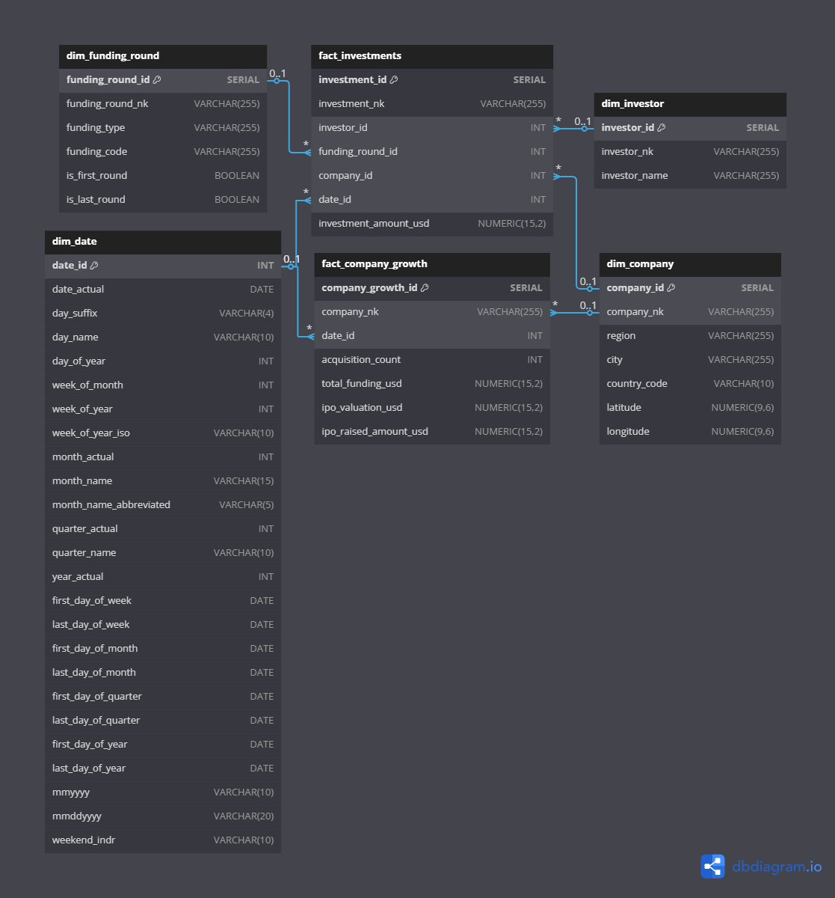

# Startup Investment Data Pipeline

---

## Table of Contents
- [Project Description](#project-description)
- [Background Problem](#background-problem)
- [Proposed Solution](#proposed-solution)
- [Requirements Gathering & Solution](#requirements-gathering--solution)
- [Data Profiling](#data-profiling)
- [Pipeline Design](#pipeline-design)
- [Layers](#layers)
- [Design Dimensional Model Process](#design-dimensional-model-process)
  - [ERD Diagram](#erd-diagram)
  - [Business Processes and Details](#business-processes-and-details)
  - [Business Process and Performance Metric Table](#business-process-and-performance-metric-table)
- [Source to Target Mapping](#source-to-target-mapping)
- [ETL Implementation](#etl-implementation)
- [Validation System and Logging](#validation-system-and-logging)
- [Scheduling](#scheduling)
- [Technology Stack](#technology-stack)
- [Installation](#installation)
- [Usage](#usage)
- [Expected Output](#expected-output)
- [Documentation](#documentation)

---

## Project Description
The **Startup Investment Data Pipeline** aims to create a unified and scalable system to integrate startup ecosystem data collected from multiple sources: databases, semi-structured files, and APIs. This solution enables dynamic insights into market trends, company growth, investment patterns, and leadership profiles within startups.

---

## Background Problem
The startup ecosystem generates massive and diverse datasets. However, these datasets are spread across:
- A **Startup Investment Database** (structured data)
- **Files** containing **people-related information** (semi-structured data)
- **Company milestone data** from an **external API** (dynamic real-time data)

Integrating these various formats into a centralized and queryable database is challenging due to differences in structure, format, and update frequency.

---

## Proposed Solution
We propose building an automated **ETL (Extract, Transform, Load) Pipeline** to:
- Seamlessly **integrate multiple sources**.
- **Transform** data into a consistent format.
- **Store** the unified data into a structured **Data Warehouse**.
- Implement **profiling**, **validation**, **logging**, and **scheduling** to ensure reliability.

---

## Requirements Gathering & Solution
- **Understand the Data**: Profiling each source (database, CSV files, API response).
- **User Needs**: Provide insights into startup performance, investment trends, leadership influence.
- **Proposed Solution**: Build a scalable ETL pipeline, dimensional Data Warehouse, and logging/validation system.

---

## Data Profiling
Data profiling was conducted on:
- Database tables (e.g., funding rounds, IPOs, acquisitions).
- CSV files (e.g., people profiles, founders).
- External API responses (e.g., milestone events).

Key profiling tasks:
- Data type checking.
- Null value assessment.
- Duplicate record identification.
- Anomaly detection.

---

## Pipeline Design
The pipeline architecture is divided into:
- **Extract**: Pull data from source systems (databases, files, APIs).
- **Load (Staging)**: Raw loading into a staging area for initial storage.
- **Transform (Warehouse)**: Clean, map, and aggregate data for analytics use.

---

## Layers
1. **Staging Layer**: Temporary storage of raw extracted data.
2. **Warehouse Layer**: Cleaned, transformed, and relational data structured for analysis.
3. **Logging System**: Tracks process success, failures, and anomalies.

---

## Design Dimensional Model Process

### ERD Diagram


The dimensional model is designed to enable efficient querying and reporting by organizing data into facts and dimensions. The main components include:

- **Fact Tables**: `fact_company_growth`, `fact_investments`
- **Dimension Tables**: `dim_company`, `dim_investor`, `dim_funding_round`, `dim_date`

| **Fact Table / Dimension**  | **dim_company** | **dim_investor** | **dim_funding_round** | **dim_date** |
|-----------------------------|-----------------|------------------|-----------------------|--------------|
| **fact_company_growth**      | X               |                  |                       | X            |
| **fact_investments**         | X               | X                | X                     | X            |

---

## Business Processes and Details

### Business Process: Company Growth

- **Declare Grain**:
  - Each record in the fact table will represent the company growth metrics (acquisitions, funding, IPO) at a specific date for a particular company.
  - This table will aggregate the growth information by company and date.

- **Identify the Dimensions**:
  - `dim_company`
  - `dim_date`

- **Identify the Facts**:
  - `fact_company_growth` (Transactional Fact Table Type)
  - Measures: `acquisition_count`, `total_funding_usd`, `ipo_valuation_usd`, `ipo_raised_amount_usd`

---

### Business Process: Investment Transactions

- **Declare Grain**:
  - Each record in the fact table will represent an investment event by an investor in a company during a funding round on a specific date.
  - This table aggregates investment data by investor, company, funding round, and date.

- **Identify the Dimensions**:
  - `dim_investor`
  - `dim_company`
  - `dim_funding_round`
  - `dim_date`

- **Identify the Facts**:
  - `fact_investments` (Transactional Fact Table Type)
  - Measures: `investment_amount_usd`

---

### Business Process and Performance Metric Table

| **Business Process**         | **Performance Metric**                                   |
|------------------------------|----------------------------------------------------------|
| **Company Growth**            | Acquisition count, total funding amount, IPO valuation, IPO raised amount |
| **Investment Transaction**    | Investment amount in USD                                 |

---

## Source to Target Mapping
Detailed mappings are documented, including:
- Source columns → Target columns.
- Transformation rules (e.g., date parsing, normalization, standardization).
- Data type conversions.

---

## ETL Implementation
- **Extract**: From PostgreSQL, CSV files, and external API.
- **Load**: Store extracted data into a staging database or filesystem.
- **Transform**: Cleanse and integrate data into the warehouse tables.

Tools used for ETL implementation:
- **Python (Pandas)** for lightweight transformations.
- **PySpark** (optional) for scalable distributed processing.
- **MinIO** (optional) for cloud object storage.

---

## Validation System and Logging
- **Validation**: Ensures data consistency and quality before loading into the warehouse.
- **Logging**: Process status, errors, and anomalies are logged into either a database or filesystem for monitoring.

---

## Scheduling
(Optional) Future improvements can include scheduling with:
- **Cron Jobs**

---

## Technology Stack

| Category                | Tools / Technologies                                    |
|-------------------------|---------------------------------------------------------|
| Programming             | Python, Pandas, PySpark (optional)                      |
| Data Storage            | PostgreSQL, MinIO (optional for object storage)         |
| Workflow Orchestration  | Docker Compose, (Future: Airflow, Cron)                 |
| API Integration         | Python Requests Library                                 |
| Monitoring              | Custom Logging                                          |
| Containerization        | Docker                                                  |

---

## Installation

### Prerequisites
- Docker
- Docker Compose
- Git

### Steps

1. **Clone the repository**
   ```bash
   git clone https://github.com/hudiyaresa/startup-pipeline-warehouse.git
   cd project_data_pipeline
   ```

2. **Run Docker Compose**
   ```bash
   docker compose up --build --detach
   ```

3. **If Using PySpark**, Copy PostgreSQL Driver to Spark
   ```bash
   docker cp driver/postgresql-42.6.0.jar pyspark_project_container:/usr/local/spark/jars/postgresql-42.6.0.jar
   ```

---

## Usage

### Option 1: Run via Container Terminal

1. Access container terminal:
   ```bash
   docker exec -it pyspark_container2 /bin/bash
   ```
2. Navigate to project directory:
   ```bash
   cd /home/jovyan/work
   ```
3. Execute script:
   - Using Pandas:
     ```bash
     python your_script.py
     ```
   - Using PySpark:
     ```bash
     spark-submit your_script.py
     ```

### Option 2: Run via Jupyter Notebook

- Open [http://localhost:8888/](http://localhost:8888/)
- Navigate and run `your_notebook.ipynb`

---

## Expected Output

| Step              | Expected Result                               |
| ----------------- | --------------------------------------------- |
| Data Extraction   | Source data available in staging             |
| Data Transformation | Cleaned and relational data loaded          |
| Data Loading      | Warehouse tables populated                   |
| Validation        | Log file and validation report generated     |

---

# Documentations
```
